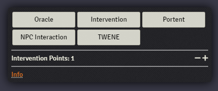
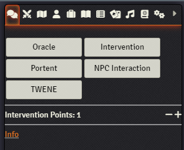
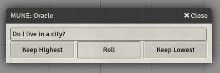
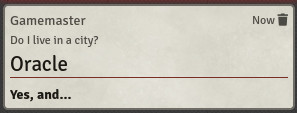

(This repo is a fork of https://gitlab.com/Furyspark/foundryvtt-mune by Tijmen Bok to continue the project)

# What is this?

This is a module that implements the [MUNE](https://homebrewery.naturalcrit.com/share/rkmo0t9k4Q) solo toolkit in FoundryVTT. In short, it adds a window with buttons for quickly rolling various aspects of MUNE.

Additionally, [here is a link](https://empaitirkosu.wordpress.com/2018/07/24/i-made-a-thing-about-how-to-play-solo/) to the original post telling the world about MUNE.

# Installation

## Using the manifest URL from within Foundry's module browser

- Copy the following URL to Foundry's module browser's installation URL field: [https://github.com/lizzard77/mune/releases/latest/download/module.json](https://github.com/lizzard77/mune/releases/latest/download/module.json)

# Screenshots

Toolkit

Oracle Dialog

Resulting Chat Message

